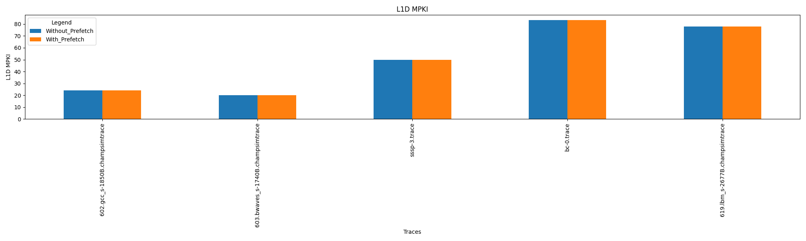

  <h1 align="center"> Summary </h1>
  
Following is the summary of all the prefetchers we have implemented.

# Task 1 : IP Stride Prefetcher

Executed all the traces with Prefetch degree ranging from 2 to 10. We have observed that degree=2 yields the higest speedup.
## Speedup

| Degree | 602 | 603 | sssp-3 | bc-0 | 619 |
| ------ | --- | --- | ------ | ---- | --- |
| 2 | 0.979 | 0.993 | 0.957 | 0.973 | 0.994 |
| 3 | 0.968 | 0.990 | 0.943 | 0.963 | 0.992 |
| 4 | 0.962 | 0.988 | 0.932 | 0.955 | 0.992 |
| 5 | 0.955 | 0.986 | 0.921 | 0.947 | 0.993 |
| 6 | 0.950 | 0.985 | 0.914 | 0.941 | 0.992 |
| 7 | 0.942 | 0.983 | 0.904 | 0.935 | 0.992 |
| 8 | 0.938 | 0.981 | 0.897 | 0.929 | 0.992 |
| 9 | 0.936 | 0.980 | 0.892 | 0.925 | 0.993 |
| 10 | 0.936 | 0.979 | 0.888 | 0.922 | 0.992|

## L1D MPKI

| Traces | Without_Prefetch | With_prefetch |
| ------ | ---------------- | ------------- |
| 602 | 24.1 | 24.1 |
| 603 | 20.0 | 20.0 |
| sssp-3 | 49.6 | 49.6 |
| bc-0 | 83.46 | 83.46 |
| 619 | 78.0 | 78.0 |
| Mean | 51.05 | 51.05 |

## L2C MPKI

| Traces | Without_Prefetch | With_prefetch |
| ------ | ---------------- | ------------- |
| 602 | 17.8 | 18.6 |
| 603 | 19.0 | 19.5 |
| sssp-3 | 38.56 | 41.34 |
| bc-0 | 74.17 | 78.37 |
| 619 | 48.37 | 48.75|
| Mean | 39.58| 41.35 |

## Accuracy

| Traces | Accuracy_Intitial | Accuracy |
| ------ | ---------------- | ------------- |
| 602 | 3.94 | 3.94 |
| 603 | 2.11 | 2.11 |
| sssp-3 | 5.67 | 5.67 |
| bc-0 | 6.85 | 6.85 |
| 619 | 6.46 | 6.47|

# Task 2 : Stream Prefetcher

Executed all the traces with Prefetch degree ranging from 2 to 6 and Prefetch Distance ranging from 3 to 4. We have observed that Degree=2 and Distance=4 yields the higest speedup.
## Speedup

| Stream_Prefetcher | 602 | 603 | sssp-3 | bc-0 | 619 |
| ------ | --- | --- | ------ | ---- | --- |
| deg2_dist3 | 0.999 | 0.993 | 0.969 | 0.949 | 0.994 |
| deg2_dist4 | 0.997 | 0.993 | 0.970 | 0.949 | 0.994 |
| deg3_dist3 | 0.995 | 0.991 | 0.955 | 0.924 | 0.993 |
| deg3_dist4 | 0.996 | 0.990 | 0.954 | 0.924 | 0.991 |
| deg4_dist3 | 0.993 | 0.988 | 0.941 | 0.900 | 0.993 |
| deg4_dist4 | 0.995 | 0.987 | 0.940 | 0.898 | 0.989 |
| deg5_dist3 | 0.990 | 0.986 | 0.927 | 0.876 | 0.991 |
| deg5_dist4 | 0.993 | 0.984 | 0.924 | 0.872 | 0.987 |
| deg6_dist3 | 0.988 | 0.984 | 0.912 | 0.852 | 0.991 |
| deg6_dist4 | 0.992 | 0.982 | 0.909 | 0.844 | 0.985 |

## L1D MPKI

| Traces | Without_Prefetch | With_prefetch |
| ------ | ---------------- | ------------- |
| 602 | 24.1 | 24.1 |
| 603 | 20.0 | 20.0 |
| sssp-3 | 49.6 | 49.6 |
| bc-0 | 83.46 | 83.46 |
| 619 | 78.0 | 78.0 |
| Mean | 51.05 | 51.05 |

## L2C MPKI

| Traces | Accuracy_Intitial | Accuracy |
| ------ | ---------------- | ------------- |
| 602 | 17.803 | 18.42 |
| 603 | 19.0 | 19.58 |
| sssp-3 | 38.56 | 46.32 |
| bc-0 | 74.17 | 104.90 |
| 619 | 48.37 | 48.78 |
| Mean | 39.585 | 47.607 |

## Accuracy

| Traces | Accuracy_Intitial | Accuracy |
| ------ | ---------------- | ------------- |
| 602 | 1.289 | 1.29 |
| 603 | 2.05 | 2.06 |
| sssp-3 | 8.87 | 8.87 |
| bc-0 | 16.3 | 16.3 |
| 619 | 2.59 | 2.59 |

# Task 3 : Prefetch Throttling
1. Implemented the IP-stride throttling and Stream throttling
2. We have taken Initial Degree=2
3. Dynamically we reduced degree by half if accuracy goes less than 0.5
4. And we are making it twice if accuracy goes beyond 0.8

## Analysis
| Prefetchers | 602 | 603 | sssp-3 | bc-0 | 619 |
| ----------- | --- | --- | ----- | ----- | --- |
| IP_stride_speedup_2 | 0.979 | 0.993 | 0.957 | 0.973 | 0.994 |
| IP_stride_Throttling_2 | 0.98 | 0.99 | 0.957 | 0.973 | 0.994 |
| Stream_prefetcher_deg2_dist4 | 0.997 | 0.993 | 0.970 | 0.949 | 0.994 |
| Stream_Throttling_deg2_dist4 | 1.004 | 1.000 | 0.831 | 0.942 | 1.000 |

# BONUS Task : Stream Plus Stride Prefetcher

Executed all the traces with Prefetch degree randing from 2 to 6 and Prefetch Distance ranging from 3 to 4. We have observed that Degree=2 and Distance=4 yields the highest speedup.

## Speedup

| Stream_Prefetcher | 602 | 603 | sssp-3 | bc-0 | 619 |
| ------ | --- | --- | ------ | ---- | --- |
| deg2_dist3 | 0.977 | 0.988 | 0.939 | 0.932 | 0.990 |
| deg2_dist4 | 0.982 | 0.988 | 0.939 | 0.933 | 0.990 |
| deg3_dist3 | 0.975 | 0.987 | 0.923 | 0.907 | 0.988 |
| deg3_dist4 | 0.970 | 0.983 | 0.916 | 0.903 | 0.986 |
| deg4_dist3 | 0.968 | 0.983 | 0.905 | 0.881 | 0.987 |
| deg4_dist4 | 0.967 | 0.982 | 0.902 | 0.879 | 0.984 |
| deg5_dist3 | 0.961 | 0.980 | 0.885 | 0.855 | 0.985 |
| deg5_dist4 | 0.961 | 0.978 | 0.881 | 0.851 | 0.981 |
| deg6_dist3 | 0.959 | 0.978 | 0.872 | 0.833 | 0.984 |
| deg6_dist4 | 0.958 | 0.975 | 0.865 | 0.824 | 0.980 |

## L1D MPKI

| Traces | Without_Prefetch | With_prefetch |
| ------ | ---------------- | ------------- |
| 602 | 24.1079 | 24.1079 |
| 603 | 20.01 | 20.01 |
| sssp-3 | 49.68 | 49.68 |
| bc-0 | 83.46 | 83.46 |
| 619 | 78.022 | 78.023 |
| Mean | 51.059 | 51.059 |

## L2C MPKI

| Traces | Without_Prefetch | With_prefetch |
| ------ | ---------------- | ------------- |
| 602 | 17.803 | 19.136 |
| 603 | 19.0 | 19.95 |
| sssp-3 | 38.56 | 48.45 |
| bc-0 | 74.17 | 108.208 |
| 619 | 48.37 | 49.154 |
| Mean | 39.58 | 48.98 |

## Accuracy

| Traces | Accuracy_Intitial | Accuracy |
| ------ | ---------------- | ------------- |
| 602 | 2.54 | 2.55 |
| 603 | 2.59 | 2.59 |
| sssp-3 | 10.03 | 10.04 |
| bc-0 | 16.86 | 16.87 |
| 619 | 4.204 | 4.2 |

